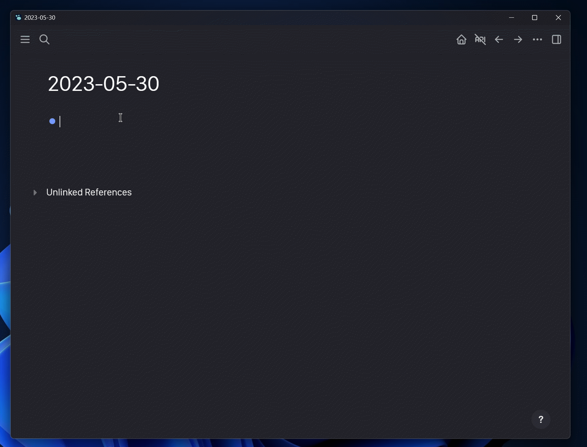
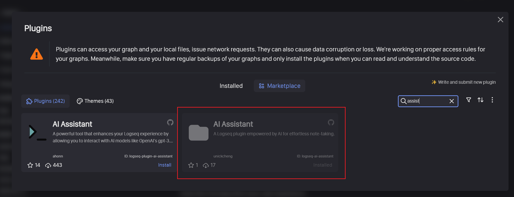

<h1 align="center">欢迎来到 AI-Assistant 👋</h1>



## 🎉使用

### 安装插件




### 配置 openai

- `openaiKey`：你的 openai key，可在 [openai.com](https://platform.openai.com/account/api-keys) 查询
- `openaiUrl`：支持你使用自己的代理地址，默认为 `https://api.openai.com` 官方地址。如果因为网络问题无法访问，可设置为 `https://openai.aihey.cc`，见 [openai-proxy](https://github.com/UNICKCHENG/openai-proxy)


### 使用

- `/gpt` 使用 openai gpt 接口


## 🚀 本地开发

**step 1 > 确保开发环境**

```bash
node -v
npm -v
git -v
```

**step 2 > 安装依赖**

```bash
# > step 1 download source code
git clone https://github.com/UNICKCHENG/logseq-ai-assistant.git
cd logseq-ai-assistant
# > step 2 installing dependencies
npm install
```

**step 4 > 构建插件**

```bash
npm run build
```


## ✍️日志

更多信息请查看 [CHANGTLOG](CHANGELOG.md)

## 💖 感谢

- https://github.com/logseq/logseq
- https://plugins-doc.logseq.com
- https://platform.openai.com
- https://github.com/pengx17/logseq-plugin-template-react
- https://github.com/briansunter/logseq-plugin-gpt3-openai
- 感谢所有为开源做出贡献的朋友