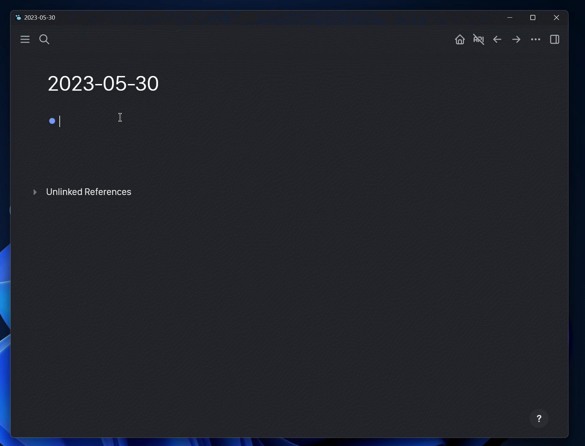
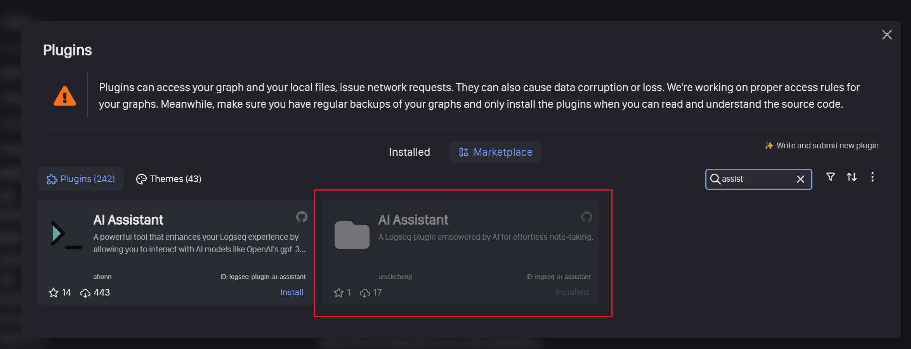
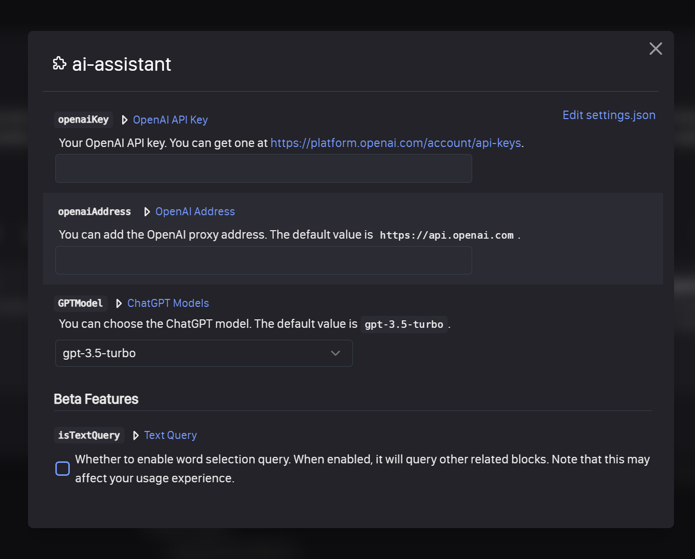

<h1 align="center">Welcome to AI-Assistant 👋</h1>



## 🎉Usage

### Installing Plugins



### Setting up openai

- `openaiKey`：your openai key, which can be found on [openai.com](https://platform.openai.com/account/api-keys).
- `openaiUrl`：You can also use your own proxy address, which defaults to the official address `https://api.openai.com`.



### Usage

- `/gpt` Use OpenAI GPT API.


## 🚀 Local development

**step 1 > Verify the local environment**

```bash
node -v
npm -v
git -v
```

**step 2 > Install dependencies**

```bash
# > step 1 download source code
git clone https://github.com/UNICKCHENG/logseq-ai-assistant.git
cd logseq-ai-assistant
# > step 2 installing dependencies
npm install
```

**step 4 > Build plugin**

```bash
npm run build
```


## ✍️Changelog

You can see more information at [CHANGTLOG](CHANGELOG.md)

## 💖 Credits

- https://github.com/logseq/logseq
- https://platform.openai.com
- https://github.com/pengx17/logseq-plugin-template-react
- https://github.com/briansunter/logseq-plugin-gpt3-openai
- Thanks to all open source projects for sharing ideas and techniques